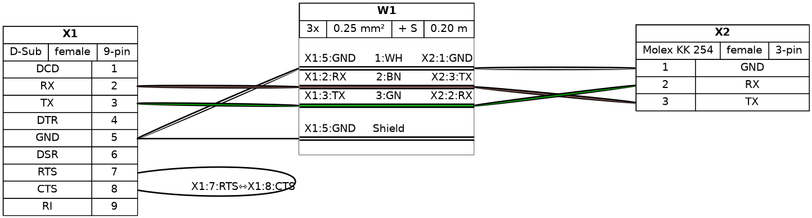

# filare (formerly WireViz)

[](https://pypi.org/project/filare/)
[](https://pypi.org/project/filare/)
[](https://pypi.org/project/filare/)
[](https://laurierloi.github.io/filare/)
[](https://github.com/psf/black)

## Summary

Filare (the new name for WireViz) is a tool for documenting cables, wiring harnesses and connector pinouts. It takes plain text, YAML-formatted files as input and produces graphical output (SVG, PNG, ...) via [GraphViz](https://www.graphviz.org/). It handles automatic BOM (Bill of Materials) creation and a number of extras.

## Features

- Filare input files are fully text based
  - No special editor required
  - Human readable
  - Easy version control
  - YAML syntax
  - UTF-8 input and output files for special character support
- Understands and uses color abbreviations as per [IEC 60757](https://en.wikipedia.org/wiki/Electronic_color_code#Color_band_system) (black=BK, red=RD, ...)
  <!-- * Optionally outputs colors as abbreviation (e.g. 'YE'), full name (e.g. 'yellow') or hex value (e.g. '#ffff00'), with choice of UPPER or lower case (#158) -->
- Auto-generates standard wire color schemes and allows custom ones if needed
  - [DIN 47100](https://en.wikipedia.org/wiki/DIN_47100) (WT/BN/GN/YE/GY/PK/BU/RD/BK/VT/...)
  - [IEC 60757](https://en.wikipedia.org/wiki/Electronic_color_code#Color_band_system) (BN/RD/OR/YE/GN/BU/VT/GY/WT/BK/...)
  - [25 Pair Color Code](https://en.wikipedia.org/wiki/25-pair_color_code#Color_coding) (BUWH/WHBU/OGWH/WHOG/GNWH/WHGN/BNWH/...)
  - [TIA/EIA 568 A/B](https://en.wikipedia.org/wiki/TIA/EIA-568#Wiring) (Subset of 25-Pair, used in CAT-5/6/...)
- Understands wire gauge in mm² or AWG
  - Optionally auto-calculates equivalent gauge between mm² and AWG
- Is suitable for both very simple cables, and more complex harnesses.
- Allows for easy-autorouting for 1-to-1 wiring
- Generates BOM (Bill of Materials)

_Note_: Filare is not designed to represent the complete wiring of a system. Its main aim is to document the construction of individual wires and harnesses.

## Examples

### Demo 01

[Filare input file](examples/demo01.yml):

```yaml
connectors:
  X1:
    type: D-Sub
    subtype: female
    pinlabels: [DCD, RX, TX, DTR, GND, DSR, RTS, CTS, RI]
  X2:
    type: Molex KK 254
    subtype: female
    pinlabels: [GND, RX, TX]

cables:
  W1:
    gauge: 0.25 mm2
    length: 0.2
    color_code: DIN
    wirecount: 3
    shield: true

connections:
  - - X1: [5, 2, 3]
    - W1: [1, 2, 3]
    - X2: [1, 3, 2]
  - - X1: 5
    - W1: s
```

Output file:



[Bill of Materials](examples/demo01.tsv) (auto-generated)

### Demo 02


[Source](examples/demo02.yml) - [Bill of Materials](examples/demo02.tsv)

### Syntax, tutorial and example gallery

Read the [syntax description](syntax.md) to learn about Filare's features and how to use them.

See the [tutorial page](https://github.com/laurierloi/filare/blob/main/tutorial/readme.md) for sample code, as well as the [example gallery](https://github.com/laurierloi/filare/blob/main/examples/readme.md) to see more of what Filare can do.

## Installation

### Requirements

Filare requires Python 3.9 or later.

Filare requires GraphViz to be installed in order to work. See the [GraphViz download page](https://graphviz.org/download/) for OS-specific instructions.

_Note_: Ubuntu 18.04 LTS users in particular may need to separately install Python 3.7 or above, as that comes with Python 3.6 as the included system Python install. The option to generate pdf is not supported for python 3.7, so it might not be possible to use with this version of Ubuntu. If you are forced to use Ubuntu 18.04 for some reason, fill up an issue/MR and I can provide a Docker image to perform the generation.

### Quick install (uv, recommended)

Filare uses the [uv](https://docs.astral.sh/uv/) workflow for dependency management and command execution.

```
uv venv
uv sync
uv run filare --help
```

### Container (Ubuntu 24.04, uv, graphviz, prettier)

A Docker image is provided to avoid local dependency setup:

```
docker build -t filare:latest .
```

Run common tasks (mount your working tree so outputs land on the host):

- Build all examples/tutorials/demos:
  ```
  docker run --rm -v "$PWD":/app filare uv run --no-sync python src/filare/tools/build_examples.py
  ```
- Build examples only:
  ```
  docker run --rm -v "$PWD":/app filare uv run --no-sync filare examples/ex*.yml -d examples/metadata.yml -f hs -o outputs/examples
  ```
- Build tutorials only:
  ```
  docker run --rm -v "$PWD":/app filare uv run --no-sync filare tutorial/tutorial*.yml -d tutorial/metadata.yml -f hs -o outputs/tutorial
  ```
- Lint (black + prettier):
  ```
  docker run --rm -v "$PWD":/app filare ./scripts/lint.sh
  ```
- Build and serve docs (port 9000):
  ```
  docker run --rm -p 9000:9000 -v "$PWD":/app filare bash -lc 'cd /app && uv run --no-sync mkdocs build && cd site && uv run --no-sync python -m http.server 9000'
  ```

## Building docs locally (without Docker)

From the project root:

```
uv run --no-sync mkdocs build
uv run --no-sync python -m http.server 9000 --directory site
```

Then open http://localhost:9000.

- Run tests:
  ```
  uv run --no-sync pytest
  ```

### Documentation (MkDocs + optional Sphinx)

- Build MkDocs site locally:
  ```
  uv run --no-sync mkdocs build
  ```
- Serve for preview:
  ```
  uv run --no-sync mkdocs serve -a 0.0.0.0:8000
  ```
- (Optional) Generate API docs with Sphinx: see `docs/mkdocs.md` for suggested setup.

#### Debian Dependencies

```
sudo apt install graphviz
```

#### Fedora Dependencies

```
sudo dnf install graphviz
```

#### Pango (only for weasyprint pdf generation)

See https://pango.gnome.org/

### Installing the latest release

Install from [PyPI](https://pypi.org/project/filare/) using uv:

```
uv venv
uv pip install filare
uv run filare --version
```

### Installing the development version

Access the current state of the development branch by cloning the repo and syncing dependencies with uv:

```
# Cloning the repository
git clone https://github.com/laurierloi/filare
cd filare

# Setup env and install dependencies
uv venv
uv sync
```

Avoid mixing `pip` and `uv` inside the same environment to prevent dependency drift. If you prefer a one-off install without a venv, use the container workflow above instead of system-wide `pip`.

If you would like to contribute to this project, make sure you read the [contribution guidelines](CONTRIBUTING.md)!

## Usage

### How to run

The Filare CLI (legacy `filare` alias still available) creates harness documents.
To do so, a shared metadata file (or multiple) must be provided to the `filare` command.
Then, a list of harnesses to include within the document should also be provided.
In the simplest case, 1 harness can be provided.

```
$ uv run filare -d ~/path/to/file/metadata.yml ~/path/to/file/myharness1.yml ~/path/to/file/myharness2.yml
```

Depending on the options specified, this will output some or all of the following files:

```
titlepage.html            Titlepage document. It has links to the different harness for easy navigation
shared_bom.tsv            A BOM (bill of materials) for all items within the harness document
myharness{1,2}.gv         GraphViz output
myharness{1,2}.svg        Wiring diagram as vector image
myharness{1,2}.png        Wiring diagram as raster image
myharness{1,2}.bom.tsv    BOM (bill of materials) as tab-separated text file
myharness{1,2}.html       HTML page with wiring diagram and BOM embedded
```

Wildcards in the file path are also supported to process multiple files at once, e.g.:

```
$ uv run filare ~/path/to/files/*.yml
```

To see how to specify the output formats, as well as additional options, run:

```
$ uv run filare --help
```

#### Sample run all examples

```
$ uv run filare -d examples/metadata.yml examples/ex*.yml
```

Then open `examples/titlepage.html` to open the document root

### Quantity multipliers (`filare-qty`)

Use `filare-qty` to capture per-harness quantity multipliers before generating a shared BOM with `filare`.

```
# Prompt for multipliers (or reuse an existing quantity_multipliers.txt)
$ uv run filare-qty tests/bom/bomqty.yml

# Apply the multipliers when building the shared BOM
$ uv run filare tests/bom/bomqty.yml --use-qty-multipliers
```

By default the multipliers are stored as JSON in `quantity_multipliers.txt` next to the harness file; override the path with `--multiplier-file-name` and re-prompt with `--force-new`.

### (Re-)Building the example projects

Please see the [documentation](buildscript.md) of the `build_examples.py` script for info on building the demos, examples and tutorial.

## Changelog

See [CHANGELOG.md](CHANGELOG.md)

## Status

This is very much a work in progress. Source code, API, syntax and functionality may change wildly at any time.

## License

[GPL-3.0](https://github.com/laurierloi/Filare/blob/main/LICENSE)
