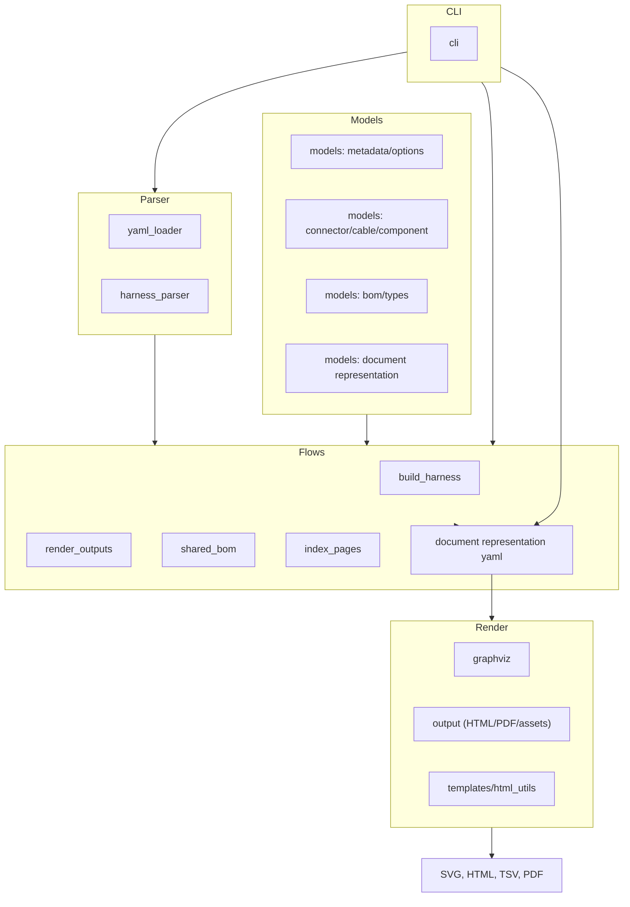

# Architecture Overview

This page gives a high-level map of how Filare fits together. For visual cheatsheets, see the Mermaid diagrams in `docs/graphs/architecture.md`, `docs/graphs/data_flow.md`, and `docs/graphs/models.md`.

## Main entry points

- CLI: `src/filare/cli.py` (exposed as `filare` via `uv run --no-sync filare ...`).
- Example/tutorial builder: `src/filare/tools/build_examples.py` drives the CLI over the example and tutorial sets.

## Visual map

## End-to-end flow

1. **Input ingestion**  
   YAML harness files (plus optional metadata) are loaded and merged via `parser/yaml_loader.py` and parsed into Python structures by `parser/harness_parser.py`.
2. **Model construction**  
   `flows/build_harness.py` turns parsed data into the core models in `filare.models` (`Harness`, `Connector`, `Cable`, `Component`, BOM entries, page options, metadata).
3. **Rendering**  
   `flows/render_outputs.py` hands the assembled `Harness` to renderers:
   - Graph output: `render/graphviz.py` builds DOT nodes/edges (including node images) and invokes GraphViz for SVG/PNG.
   - Tabular/text output: `render/output.py` writes BOM/TSV and HTML wrappers; `render/templates.py` provides the Jinja templates and HTML helpers.
4. **Document representation**  
   `flows/build_harness.py` now emits a pre-render `DocumentRepresentation` (YAML) capturing metadata, page stubs, notes, and BOM (if enabled). Hash tracking prevents overwriting user-edited documents.
5. **Aggregate artifacts**
   - `flows/shared_bom.py` emits a combined `shared_bom.tsv`.
   - `flows/index_pages.py` builds title pages and PDF bundles.
6. **Outputs**  
   SVG/PNG diagrams, HTML pages (diagram + title block), TSV BOMs, shared BOM, and optional PDF bundles end up under the requested output directory.

## Extending/operating

- Update metadata/templates: tweak `examples/metadata.yml` or the templates under `src/filare/templates/`.
- Add formats or post-processing: extend `render/output.py` and, if needed, `flows/render_outputs.py`.
- Batch generation: call `uv run --no-sync python src/filare/tools/build_examples.py` (uses the same pipeline as the CLI).
- Build document YAML only (no render): `uv run --no-sync filare examples/ex01.yml -d examples/metadata.yml -f "" -o outputs` (document YAML and hashes are emitted alongside outputs).
- Force a document YAML refresh: remove `*.document.yaml` and `document_hashes.yaml` before rerun, or edit the YAML to keep your changes (hash guard prevents overwrite).
- Page types: see `docs/pages.md` for the list of page types (title, harness, bom, cut, termination) and their roles; enable cut/termination via `options.include_cut_diagram` / `options.include_termination_diagram`.
