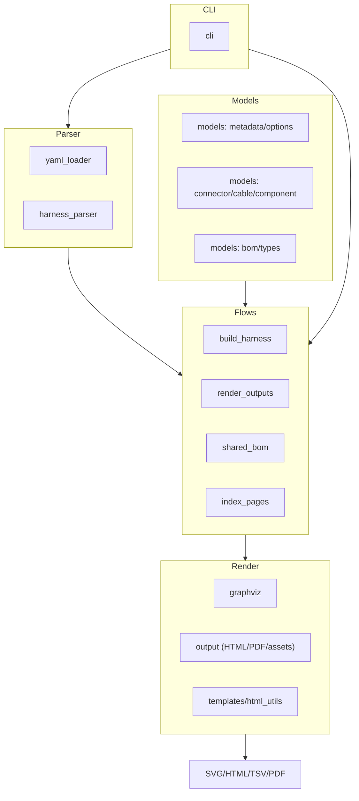

# Filare Architecture (Mermaid)

```mermaid
flowchart TD
  subgraph Models
    A1[models: metadata/options]
    A2[models: connector/cable/component]
    A3[models: bom/types]
  end

  subgraph Parser
    P1[yaml_loader]
    P2[harness_parser]
  end

  subgraph Flows
    F1[build_harness]
    F2[render_outputs]
    F3[shared_bom]
    F4[index_pages]
  end

  subgraph Render
    R1[graphviz]
    R2["output (HTML/PDF/assets)"]
    R3["templates/html_utils"]
  end

  subgraph CLI
    C1[cli]
  end

  Parser --> Flows
  Models --> Flows
  Flows --> Render
  Render --> Outputs["SVG/HTML/TSV/PDF"]
  CLI --> Parser
  CLI --> Flows
```
