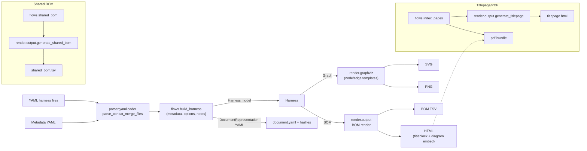

# Data Flow (Mermaid)

```mermaid
flowchart LR
  Y["YAML harness files"] --> P1["parser.yamlloader<br/>parse_concat_merge_files"]
  M["Metadata YAML"] --> P1
  P1 --> F1["flows.build_harness<br/>(metadata, options, notes)"]
  F1 -->|Harness model| H[Harness]
  F1 -->|DocumentRepresentation YAML| D1["document.yaml + hashes"]
  H -->|Graph| R1["render.graphviz<br/>(node/edge templates)"]
  H -->|BOM| R2["render.output<br/>BOM render"]
  R1 --> SVG[SVG]
  R1 --> PNG[PNG]
  R2 --> TSV["BOM TSV"]
  R2 --> HTML["HTML<br/>(titleblock + diagram embed)"]
  subgraph Shared BOM
    F3[flows.shared_bom] --> S1[render.output.generate_shared_bom]
    S1 --> SharedTSV[shared_bom.tsv]
  end
  subgraph Titlepage/PDF
    F4[flows.index_pages] --> T1[render.output.generate_titlepage]
    T1 --> TitleHTML[titlepage.html]
    F4 --> PDF[pdf bundle]
  end
  HTML -.-> PDF
```
