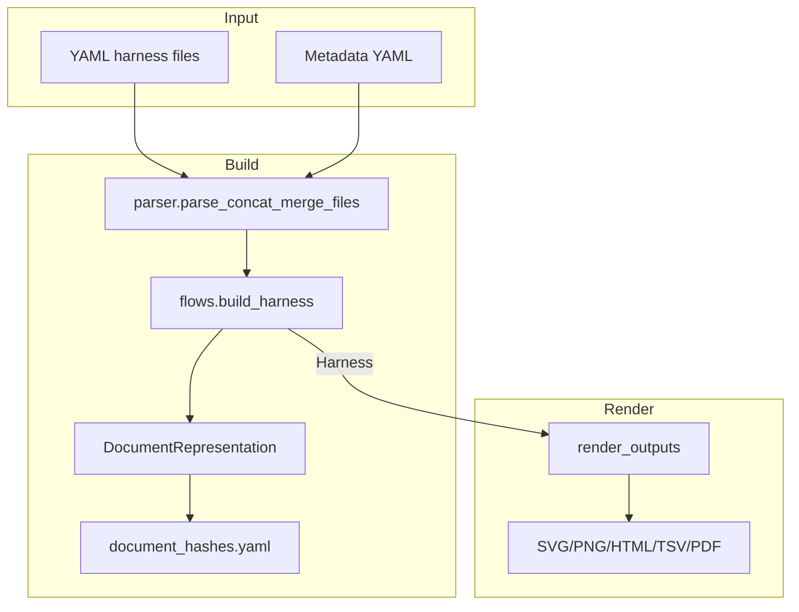

# Document Representation Flow (Mermaid)

Key points:

- `DocumentRepresentation` captures metadata, page stubs, notes, BOM (if enabled), and options.
- Written to `*.document.yaml` with hash tracking in `document_hashes.yaml`; user edits are preserved (no overwrite if hash changes).
- Rendering still operates on the harness; the document YAML is a pre-render view for inspection or manual tweaking.
- If a matching `*.document.yaml` already exists, it is loaded to drive options/page selection and merged formats before rendering.
