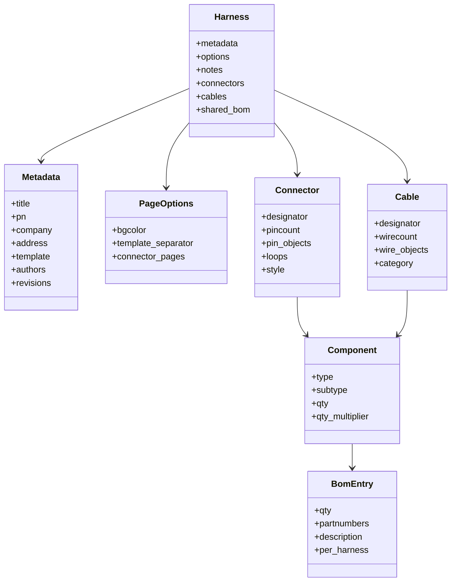

# Key Models (Mermaid)

```mermaid
classDiagram
  class Metadata {
    +title
    +pn
    +company
    +address
    +template
    +authors
    +revisions
  }
  class PageOptions {
    +bgcolor
    +template_separator
    +connector_pages
  }
  class Harness {
    +metadata
    +options
    +notes
    +connectors
    +cables
    +shared_bom
  }
  class Connector {
    +designator
    +pincount
    +pin_objects
    +loops
    +style
  }
  class Cable {
    +designator
    +wirecount
    +wire_objects
    +category
  }
  class Component {
    +type
    +subtype
    +qty
    +qty_multiplier
  }
  class BomEntry {
    +qty
    +partnumbers
    +description
    +per_harness
  }

  Harness --> Metadata
  Harness --> PageOptions
  Harness --> Connector
  Harness --> Cable
  Connector --> Component
  Cable --> Component
  Component --> BomEntry
```
