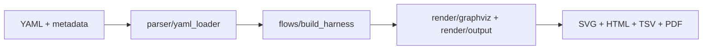

# Mermaid Sanity Check

This page exists to verify that Mermaid diagrams render correctly in the published docs and to exercise the `scripts/check-mermaid.sh` test.

```mermaid
flowchart LR
  Input[YAML + metadata] --> Parser[parser/yaml_loader]
  Parser --> Flows[flows/build_harness]
  Flows --> Render[render/graphviz + render/output]
  Render --> Outputs[SVG + HTML + TSV + PDF]
```
